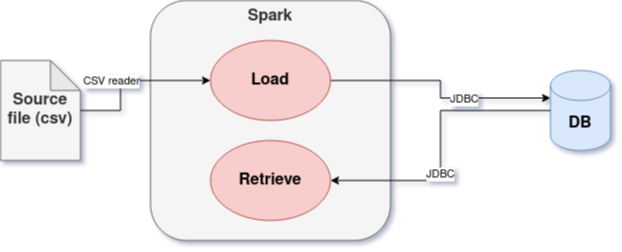

# Example of data analysis with Spark 3

## Introduction

In this recreational project we will use Spark 3 to:
 - analyze a dataset of books (https://www.kaggle.com/meetnaren/goodreads-best-books?select=book_data.csv)
 - load the first 1000 books (ordered by weighted rating) to a DB
 - compute the top 10 list of genre for the books, starting from the data we previously wrote to DB

We will do everything from scratch so you may find this useful for:
 - Understanding the basics of SparkSQL API in a simple, working, example
 - Install all the necessary tools (IDE, build tools, DB, DB drivers...)
 - Understanding how many issues you can have when you work on random datasets out there (but you already know this, don't you?)

## Tools and setup

In this document we will see how to run the code and the analysis, but first we will need to setup the environment.

For this project the used tools are:
 - **Spark 3.1.1** (https://spark.apache.org/docs/3.1.1/): the unified analytics engine for large-scale data processing. Used:
  - from Maven, as dependency
  - from binaries, in order to use the *spark-shell*.

  I preferred to use it from Scala with respect to Python because Scala is the language I know better and I always used since the day I approached Spark. In addition, Scala is a static-typed language, while Python is dynamically typed, and in my opinion this makes Scala a more readable language (if you make types explicit of course) and makes it easy to handle bigger projects.
 - **MariaDB 10.5.9** (https://mariadb.com/kb/en/documentation/): relational DB, known to be born from the same authors of MySQL. I chose this DB because it's one of the most popular DBs, opensource, and, last but not least, cloud ready. In fact, you can find it for example in AWS (https://mariadb.com/kb/en/mariadb-on-amazon-rds/).
 - **Apache Maven 3.6.3** (https://maven.apache.org/guides/getting-started/index.html): build tool. Since my first approach to Scala and Spark, I found SBT less documented and stable, so I preferred to use Maven. That's probably because SBT is newer than Maven, so things may be changed now, but I usually stick to Maven when it comes to builds.
 - **IntelliJ IDEA 2020.1.1 (Community Edition)** (https://www.jetbrains.com/help/idea/2020.1/discover-intellij-idea.html): IDE. In my opinion one of the best IDEs out there. It's complex and resource consuming, but it has a lot of useful functionalities and default keyboard shortcuts are comfortable.
 - **GIT 2.25.1** (https://git-scm.com/docs): code versioning system. Nothing else to say.
 - **Atom** (https://atom.io/): the text editor used to write this documentation. Nice interface, lots of packages, plugins and functionalities.

### Architecture

This is a simple diagram of the architecture of this example



The Spark application will have two jobs:
1. The ***load*** job, that will take the source csv as input, make some computations, and load it to the DB, via JDBC connection. The computation will compute the first 1000 books based on some rating.
2. The ***retrieve*** job, that will take the data stored in the DB as input, and do some more computation, in order to create the top 10 genres.

#### Why JDBC
As you can see, the amount of data to be transfered to/from the DB is very small. For this reason we can stick to a JDBC connection, usually slower than other methods, but it allows us to easily change the DB by changing the application's configuration and the JDBC driver. For higher throughput MariaDB supports a Columnar Storage engine https://mariadb.com/kb/en/mariadb-columnstore/ with dedicated Bulk Data Adapters, but this is a specific implementation for MariaDB, it would be overkilling, and would not allow us to change the DB. The latter could be useful in some situations.

### Setup the environment

I will assume you will work on Debian based Linux distribution (I use Lubuntu). For this reason, some commands (e.g. install new packages) may differ from your O/S version.

NOTE: I will not focus on the installation of IDE and Text Editor. You can find useful documentation/instructions on the links above.

1. **Data source**. Download the file "book_data.csv.zip" at https://www.kaggle.com/meetnaren/goodreads-best-books?select=book_data.csv. Note: Kaggle account needed. Put the downloaded file in the desired directory and unzip it
```bash
unzip book_data.csv.zip
```
This file contains book data organized in the following columns:
 - **book_authors**: The author(s) of the book, separated by '|'
 - **book_desc**: A description of the book, as found on the Goodreads web page of the book
 - book_edition: Edition of the book
 - book_format: Format of the book, i.e., hardcover, paperback, etc.
 - book_isbn: ISBN of the book, if found on the Goodreads page
 - book_pages: No. of pages
 - **book_rating**: Average rating given by users
 - **book_rating_count**: No. of ratings given by users
 - book_review_count: No. of reviews given by users
 - **book_title**: Name of the book
 - **genres**: Genres that the book belongs to; This is user-provided information. The field, as the "book_authors" is a list separated by '|'
 - **image_url**: URL of the book cover image

  The input field that will be loaded in the output DB are highlighted in **bald**.

2. **JDBC Driver**. This implementation leverages JDBC connection for the reason explained in the *Architecture* paragraph. Download the JDBC Driver here https://mariadb.com/downloads/#connectors and keep it in a location of your preference. We will use it later.

3. **Spark**. This is needed if you want to explore the data via spark-shell, otherwise you can skip this part because Spark will be downloaded from Maven as a dependency. You can download Spark from here https://spark.apache.org/downloads.html, then you need to extract the file in the desired location. If you would like to test using the JDBC connection you will also have to put the JDBC Driver (see step *2*) in the *jars* folder inside the base folder of your downloaded Spark Distribution. You can then load a JDBC driver with spark-shell with the following code (assuming 2.7.2 MariaDB JDBC version):
```bash
./bin/spark-shell --driver-class-path jars/mariadb-java-client-2.7.2.jar --jars jars/mariadb-java-client-2.7.2.jar
```
Otherwise you can just run the *spark-shell* by issuing the simpler command:
```bash
./bin/spark-shell
```

4. **MariaDB**. As mentioned above, for this example project MariaDB has been chosen as the DB where the result of the computation will be stored.
 - Download from here https://mariadb.org/download/ the version 10.5.9 (or the version you prefer) of MariaDB
 - Check the file with the checksum
 - Untar the file in the location you prefer
 ```bash
  tar -xzvf mariadb-${downloaded-version}.tar.gz
  ```
 - Follow the instruction here: https://mariadb.com/kb/en/installing-system-tables-mysql_install_db/. You need to run the install script from the base folder of the mysql installation.
 ```bash
 #Install
 ./scripts/mysql_install_db --user=mysql
 #Start (Set SQL mode to allow writes from JDBC with Spark)
 ./bin/mysqld_safe --sql-mode='ANSI_QUOTES' --datadir='./data'
 #Test installation
 cd './mysql-test' ; perl mysql-test-run.pl
 ```
 - Connect to mysql to the test DB
 ```bash
 mysql test
 #After the above command you should enter the MariaDB console. Type 'exit;' to quit. If you get any errors about libncurses5 (like I did) try
 sudo apt-get update
 sudo apt-get install libncurses5
 #Then try to get to MariaDB's console again
 #After connection to MariaDB'0's console, check if you can see databases
 show databases;
 #Then quit MariaDB console
 exit;
 ```
 - Shutdown MariaDB. At the end of your day you might want to shutdown the MariaDB server. Use the command *SHUTDOWN* to stop MariaDB server (from MariaDB console).

5. **MariaDB: database**. We are now ready to setup MariaDB database and table to store the output data
 ```bash
 #Open mysql client
 mysql
 #Create database. Character set is "unconventional" because of special characters in the data set
 CREATE DATABASE IF NOT EXISTS books_example
 CHARACTER SET = 'utf8mb4'
 COLLATE = 'utf8mb4_general_ci';
 #Create table (column sizes were determined with data analysis. See 'Data considerations' paragraph)
 use books_example;
 CREATE TABLE IF NOT EXISTS ranking (
 book_title VARCHAR(1024),
 book_weight_rating FLOAT,
 book_desc TEXT,
 book_authors VARCHAR(1024),
 genres VARCHAR(512),
 image_url VARCHAR(2048),
 book_rating FLOAT,
 book_rating_count INT
 );
 ```

6. **MariaDB: user and grants**
```bash
#Issue all commands after logging in the MariaDB console
CREATE USER 'sparkjob'@'%';
GRANT INSERT ON books_example.ranking to 'sparkjob'@'%';
GRANT SELECT ON books_example.ranking to 'sparkjob'@'%';
SET PASSWORD FOR 'sparkjob'@'%' = PASSWORD('${pwd}');
```

7. **Maven**
```bash
sudo apt-get update
sudo apt install maven
```

8. **GIT**. You can follow the instructions here https://www.atlassian.com/git/tutorials/install-git#linux

8. TODO capire dove mettere. In order to make a configurable job, a configuration file is needed. I called it application.conf and this is the content you might want to change to use it with your configuration. Even if you want to change your DB. You will need to change ***username*** and ***password*** and also the other values depending on your configuration. The file is in the resources path of the application. You might want to add more configurations in order to be able to switch DB by changing configuration
```json
it.kirsoft.examples.booksanalysisspark {
  spark {
    app-name = "books-analysis-spark"
    master = "local[2]"
    log-level = "INFO"
  }
  db {
    url = "jdbc:mariadb://localhost:3306/books_example"
    dbtable = "ranking"
    username = "yourusername"
    password = "yourpassword"
  }
}
```


10. Run project
```bash
#Retrieve job
java -cp "booksanalysisspark-1.0-jar-with-dependencies.jar:${LOCATION_FOR_mariadb-java-client-2.7.2.jar}" it.kirsoft.examples.booksanalysisspark.Main application.conf retrieve
#Load job
java -cp "booksanalysisspark-1.0-jar-with-dependencies.jar:${LOCATION_FOR_mariadb-java-client-2.7.2.jar}" it.kirsoft.examples.booksanalysisspark.Main application.conf retrieve ${LOCATION_FOR_book_data.csv}
```

1. Installazione linguaggio/framework/tools
 - Descrivere tools utilizzati e perché scelti
2. Build ed esecuzione comando
3. Come interrogare i dati

## Data considerations

(TODO) Incollare considerazioni fatte sui dati

## Elaborazione

N.B. Descrivere le scelte algoritmiche svolte

1. Computing book weight rating. Because of the data consideration (nr. 4) on book titles, the used formula will be ***book_rating * book_rating_count***. Using the "max" function is a simplification, because it could unfortunately lead to the creation of a mix of different records with respect to the input data. For example given a book with title A with two record, one with ***image_url*** B and ***book_desc*** E and the other with ***image_url*** D and ***book_desc*** C, we will have at the end a record with ***image_url*** D and ***book_desc*** E (a new record, not seen in the input data).

2. Ranking computation: for this field I used the ***row_number*** function of Spark, on a window based on the descendant ordering over the weight rating. No partitioning has been used.

3. Scrittura primi 1000 libri su DB

4. **Write the query to compute the first 10 genres**. I assumed to compute the top 10 list based on the 1000 records that were written in the DB. Each book as more than one genre (see ***"Data considerations", nr. 7***) so the approach must take into account a deduplication phase. In addition, I leveraged the ***book_weight_rating*** to score the genres. Thus, in order to compute the top list, the following steps have been implemented:
 - Define the table of each distinct genre of each book, followed by the ***book_weight_rating*** of the book
 - Sum the ***book_weight_rating*** grouping by genre, to find the ***genre_weight_rating***
 - Order the table by desceding order of ***genre_weight_rating*** and take the first 10 elements.

5. Rendere processo riproducibile e automatizzato

## Testing

N.B. Istruzioni su come testare il programma

## Deployment

#### DB considerations
MariaDB is "cloud ready": https://mariadb.com/kb/en/mariadb-on-amazon-rds/

private o public cloud? Perché?

considerazioni tecniche e lato security

**Security**
Security in Spark is OFF by default. This could mean you are vulnerable to attack by default. Please see Spark Security before running Spark. https://spark.apache.org/docs/latest/security.html

For the purpose of this example, no security has been configured on the DB side. Remember to change passwords of the users in production environment and to configure MariaDB security.

Tool di deployment eventuali


private o public cloud?
technical considerations
security considerations
tool for deployment
JDBC cloud ok with small data

### Exit status

Different exit status are configured:
1. in case of wrong number of parameters in input
2. in case of errors while reading job configuration

### TODO
Logging management
Paring arguments
Write version of the tools used (mariaDB, spark and so on)
